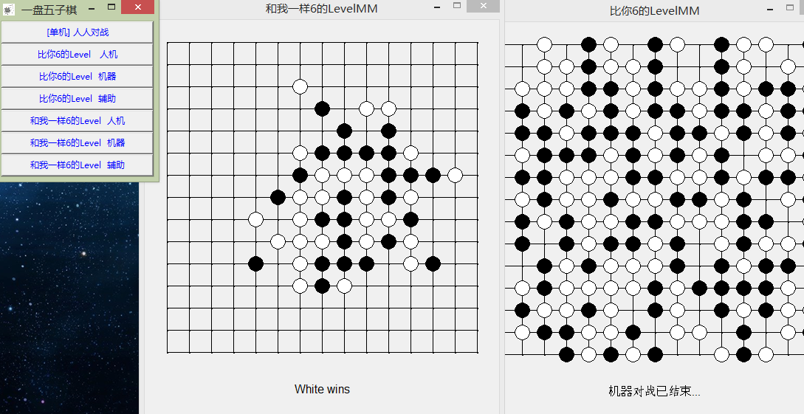
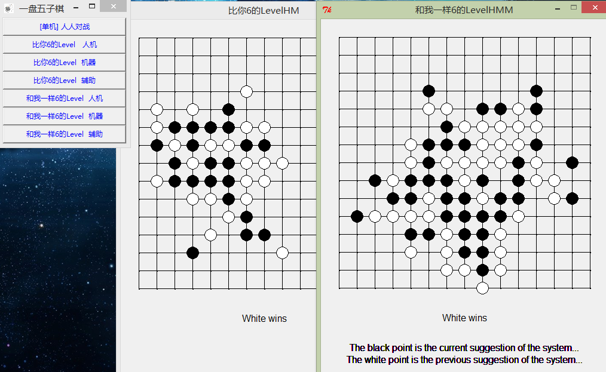
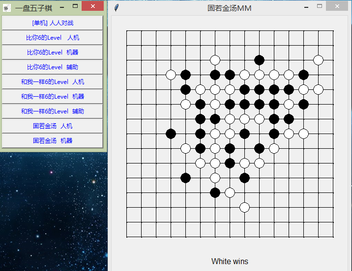
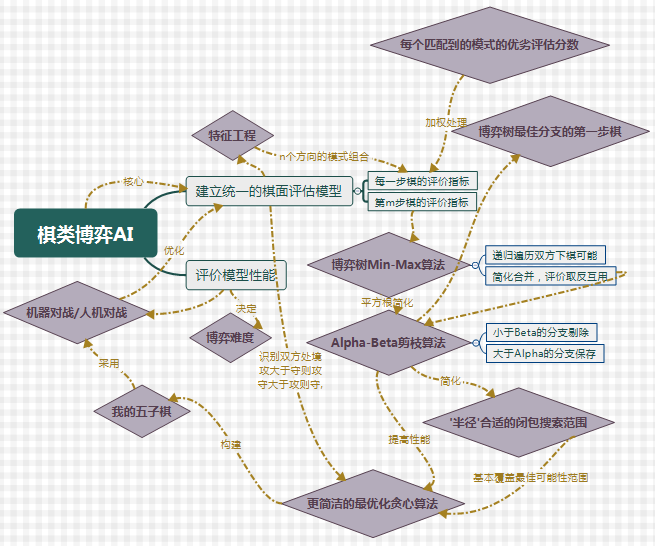

# 五子棋游戏
尝试了博弈树Min-Max + alpha-Beta剪枝方法，并找到了更好的适用于五子棋智能的棋局评估模型和选择模型

* v1.1版本 Level 1 / Level 2 (棋的AI效果还可以)，
包含人人对战、人机对战、机器对战结果和机器辅助手段

* v1.2版本修复了许多关键bug，五子棋基础AI性能提升，并更名为 比你还6的Level (难度大于) 跟我一样6的Level 

* v1.3版本为非强化学习的正式版本 修复了棋局退出异常的bug，已移至master分支。v2.0版本将进行Q-Learning和Sarsa的强化学习构造

* v1.4版本更新了机器防守模式

# 运行环境
### python 2.7/3.6 (前期在2.7开发,后期强化学习在3.6开发，两个版本都可以运行游戏)

# 运行方式
### 把上面的graphics.py复制进你python安装目录下的Lib文件夹
### 然后直接运行Main.py即可进入游戏
### v1.3

### v1.4

# 我的开发思路(思维导图)
